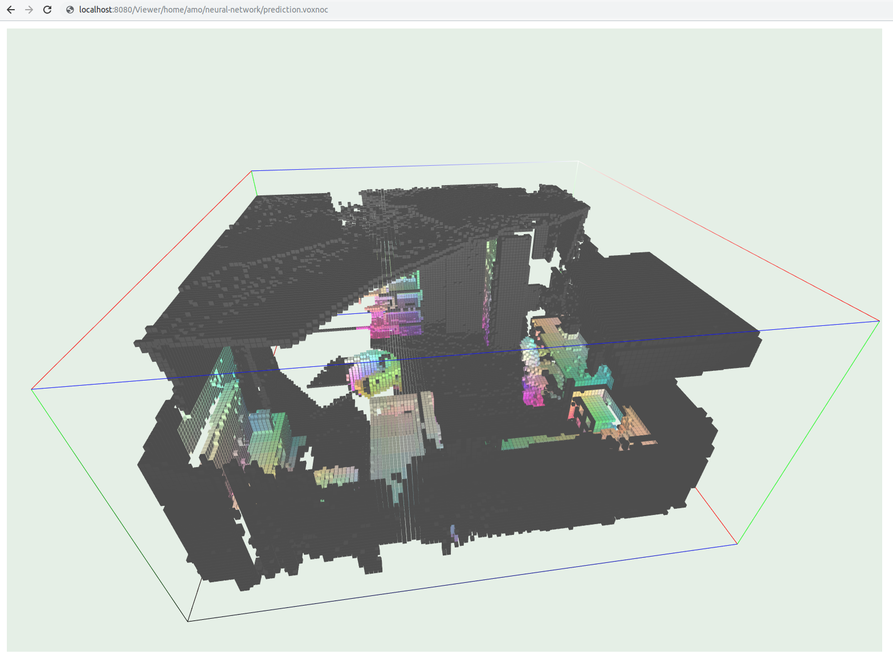
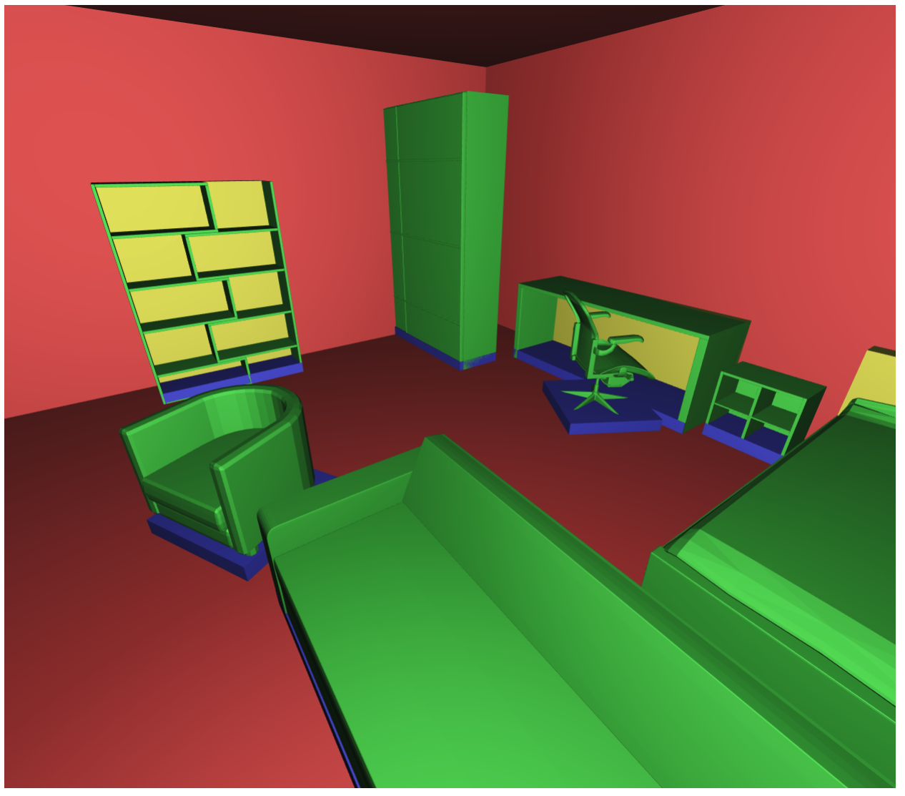

# ServerMeshViewer

## Description: 

This is a WebGL based renderer for following file formats:

- ```vox, vox2, voxnoc``` (dense voxel grids)
- ```ply, obj``` (meshes)
- ```wrf``` (wireframe files)
- ```.json``` (scene files, can be used in mitsuba)
- ```jpg, png, gif``` (images)


## How-To Use

Just pase the absolute path of your file in the browser and it will render that file automatically:

```localhost:8080/Viewer/[abspath-to-file]```


### Example:
Open firefox or chrome and goto:

```localhost:8080/Viewer/home/amo/neural-network/prediction.voxnoc```

| ```.voxnoc```   (voxelwise rgb color)         |  
:-------------------------:|

| ```.json``` (scene fileformat) |

| ```.ply``` (this is a black bunny lol)   |  

| ```.wrf``` (wireframe format)   |  

| ```.vox2``` (this is a heatmap)   |  


### Get started

1. Clone this repo 
2. `cd repo-name` (enter downloaded repository folder)
3. Install `nodejs` (=`npm`) from [https://nodejs.org/en/](https://nodejs.org/en/)
4. Run `npm install` for client-side 
    * This will install all dependencies specified in `package.json`
5. `cd ./server/ && npm install` for server side.
6. Run `./build.sh` to compile
    * Run `./watch.sh` to develop with `javascript` (compiles with every change).
7. Run `./server/run.sh` to start the server.
8. Go to *localhost:8080/Viewer/[abspath-to-file]* 

